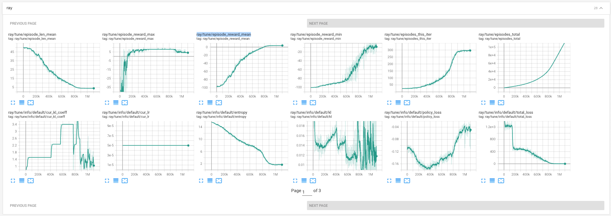

-  **Directory:** **~/code/analog-ml/AutoCkt-optimize-Zhenxin_S_FC_65nmPTM-run14** 
	- **hostname**: server-2
	- forked from `AutoCkt-optimize-Zhenxin_S_FC_65nmPTM-run12`
	-  branch: `AutoCkt-optimize-Zhenxin_S_FC_65nmPTM-run14`
	- **purpose**: reduce the number tunnable parameters: `W` and `CC` only
	- new things added:
		- reduce the tunable parameters to 11.
	- things have modified:
		- change unit to "nm"
	- tensorboard:  `PPO_Zhenxin_S_FC_0_2025-09-04_16-10-519x116nc6`
	- errors:
	- solutions:
	- **resume**
	- **completion notes**
		- matches expectation: yes
		- After 800k (7 hours 30 min on server-2) reached `ray/tune/episode_reward_mean=0.0`